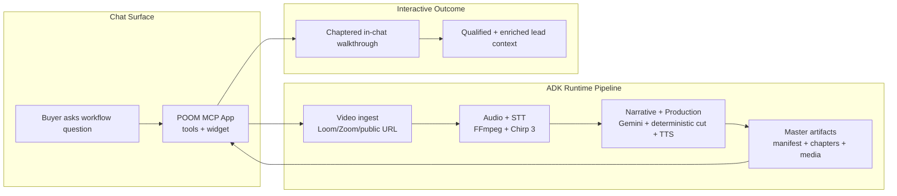

# POOM MCP App

POOM is an AEO-native marketing intelligence app that turns buyer questions in ChatGPT/Claude into personalized SaaS walkthroughs and qualified vendor leads, by converting Loom, Zoom, or any publicly accessible product video into an interactive POOM experience.

This repository contains the ChatGPT/Manufact MCP app layer (tools + widget UI).

## Why this matters

SaaS buyers are increasingly evaluating products inside AI chat, not just search pages.

Buyers ask:

`"I'm considering Puzzle. How easy is it to create a journal entry and a PO?"`

POOM answers with personalized product proof, not generic marketing pages or long untargeted demos.

## The problem

### Buyers

- Need quick answers to exact workflow questions.
- Do not want to watch long generic demo videos.
- Need confidence before engaging sales.

### Sellers

- Have demo content but limited assistant-native discoverability.
- Need AEO (Answer Engine Optimization), not only SEO.
- Need qualified and enriched lead context, not just form fills.

## What this app does

1. Receives a buyer intent query in ChatGPT/Claude.
2. Opens an interactive walkthrough widget for a relevant run.
3. Streams chaptered playback and contextual quiz interactions.
4. Supports structured interaction patterns that can feed lead qualification workflows.

## End-to-end in-widget flow

Everything happens inside the ChatGPT widget:

1. Create POOM: user requests a personalized walkthrough from a question or source video.
2. Track POOM progress: widget shows live generation status (ingest, segmentation, script, dubbing, ready).
3. View previous POOMs: user can open past generated POOMs from run history.
4. Play a POOM: user watches the chaptered interactive walkthrough directly in the widget.

No context switching, no external dashboard required.

## Demo videos

- [POOM demo 1](https://youtu.be/q7a79l-Vrj8)
- [POOM demo 2](https://youtu.be/s0HEro9KqIM)

## How the ADK pipeline runs



## What is in this repo

- `index.ts`: MCP server/tool definitions and backend API bridge.
- `resources/tutorial-player/widget.tsx`: interactive tutorial player widget.
- `resources/tutorial-player/widget.css`: widget styling.
- `resources/tutorial-player/types.ts`: widget prop contracts.
- `public/`: static assets for app icon/favicon imagery.

## MCP tools exposed

- `list_runs`
- `list_pooms`
- `create_poom`
- `get_poom_status`
- `open_run_player`
- `get_segment_quiz`
- `submit_segment_quiz`

## Companion backend dependency

This MCP app expects a runtime API that provides:

- `GET /runs`
- `GET /runs/{run_id}/manifest`
- `GET /pipeline/jobs`
- `POST /pipeline/jobs`
- `GET /pipeline/jobs/{job_id}`
- `GET /quiz/{run_id}/{segment_id}`
- `POST /quiz/{run_id}/{segment_id}/score`
- media/chapter endpoints returned in manifest payloads

The backend currently used by our team is the POOM/Peazy Explorebook runtime service.

## Local development

### Prerequisites

- Node.js 22+
- npm
- Running runtime API reachable from this app

### Install and run

```bash
npm install
npm run dev
```

Inspector:

`http://localhost:3000/inspector`

## Environment variables

- `ADK_API_BASE_URL` (default: `http://localhost:8000`)
- `ADK_API_TIMEOUT_MS` (default: `9000`)
- `ADK_DEFAULT_RUN_ID` (optional)
- `MCP_URL` (set by platform on deploy; local default: `http://localhost:3000`)

## Deploy

```bash
npm run deploy
```

## Public positioning

POOM helps SaaS teams win assistant-native discovery and conversion by turning existing product videos into personalized interactive walkthroughs and lead intelligence inside ChatGPT/Claude.
